# Milestone Project 1 - Muse Fanpage


## Live Site

The live site for this project can be found at this link:
<https://99bjacko.github.io/milestone-project-1/index.html>

## GitHub Repository

The GitHub Repository for this project can be found at this link: <https://github.com/99bjacko/milestone-project-1>

## Objective

In this project, I intend to create a fanpage for my favourite band, Muse. The goal of this website is to share my passion for the English rock band and potentially discover other people who share the same passion. The main objective is to demonstrate my capabilities in both HTML and CSS, resulting in an aesthetically pleasing, static webpage with clear navigation and intent.

## UX

### User Stories

- As a visitor to the website, I want the navigation between pages to be easy and intuitive.
- As a visitor to the website, I want the website to be responsive on a number of different devices.
- As a visitor to the website, I want to easily find information about the band.
- As a visitor to the website and somebody who is new to the band, I want the website to display relevant information about who Muse are.
- As a visitor to the website and somebody who is new to the band, I want the website to show the band's work.
- As a visitor to the website and somebody who is new to the band, I want the website to feature links to social media for the band.
- As a visitor to the website and somebody who is already a Muse fan, I want to know about why the author likes the band.
- As a Muse fan interested in finding other Muse fans, I want to be able to contact the creator of the website.

### Opportunities

Derived from user stories
| Opportunities | Importance | Viability / Feasibility |
| ------------- | ---------- | ----------------------- |
|Easy and intuitive navigation between pages | 5 | 5 |
|Responsive site suitable for mobile, tablet and desktop screen sizes | 5 | 5 |
|Provide general information about the band | 5 | 5 |
|Illustrate the passion I have for the band | 5 | 5 |
|Illustrate my experiences with the band including live performances I have been to | 5 | 5 |
|Provide information about the band's discography | 5 | 5 |
|Provide the band's social media links linking to the relevant pages in a new tab | 5 | 5 |
|Provide a contact page so users can get in touch | 4 | 5 |

### Initial Concept

Beautifully displayed images and simple but eye-catching design are key for this website. The design should be kept free from distractions, not cluttered. Using a color scheme matching the band's black and white logo, this will allow images to stand out and the content will maintain contrast throughout. The website will be designed mobile-first, but will be responsive for other screen sizes.

#### Wireframes

For initially designing the project, I utilised Balsamiq to produce wireframes. This step really allowed me to plan how I wanted things to look ahead of time, meaning I could focus on making my website look like the designs, instead of trying to make design decisions and program simultaneously.

- [Home Page Wireframe](./docs/wireframes/home_page_wireframe.png)
- [Discography Page Wireframe](./docs/wireframes/discography_page_wireframe.png)
- [Gigs Page Wireframe](./docs/wireframes/gigs_page_wireframe.png)
- [Gallery Page Wireframe](./docs/wireframes/gallery_page_wireframe.png)
- [Contact Page Wireframe](./docs/wireframes/contact_page_wireframe.png)

#### Colour Scheme

The colour scheme for this project was a simple decision to make. The Muse colour scheme centres around black with white accents, as seen in their logo. I believe that darker themes often look a lot cleaner too, so it made sense to stick with the theme of the band.

#### Typography

The typography for this project, in many ways is similar to the colour scheme. The typeface used, IBM Plex Sans, is the same one utilised by Muse on their own website, so it very much fits into the theme of a Muse fanpage.

## Features

### Common Features

- Navigation Bar

  - The design of the navigation bar is kept consistent across all of the pages of the website, following convention with a brand text on the left hand side and navigation links on the right.
  - The navigation bar includes links to Home, Discography, Gigs, The Gallery and Contact Me, in addition to having a link on the brand text, which follows convention as it links back to the homepage, a common shortcut that users are typically used to.
  - The navigation bar is fully responsive with smaller screens having a collapsed menu with a navigation toggler button and larger screens having a fully expended navigation bar.
  - The current page is shown as active in the navigation bar by appearing in solid white, with the other page links appearing in a grey colour, visibly indicating that they are inactive.
  - The navigation satisfies the first user story as it is easy and intuitive.
  - The navigation satisfies the second user story as it is responsive on a number of different devices.


- Footer

  - The design of the footer is kept consistent across all pages of the website, following convention by having logo links to social media platforms.
  - The logo links provide an easy way of learning more information about Muse, allowing users to easily see what Muse have been posting.
  - The footer satisfies the third user story as it allows users to easily find more information about the band.
  - The footer satisfies the sixth user story as it features links to the band's social media pages.


- Page Heading

  - All pages besides the home page feature a simple page heading with appropriate vertical space between navigation bar and main page content
  - The headings follow the consistent style of the website and do not add unnecessary clutter.


### Home Page

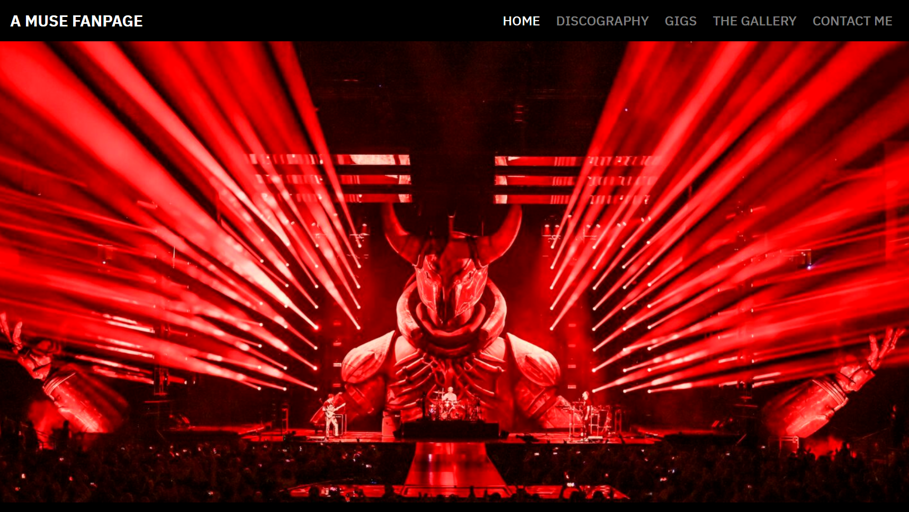
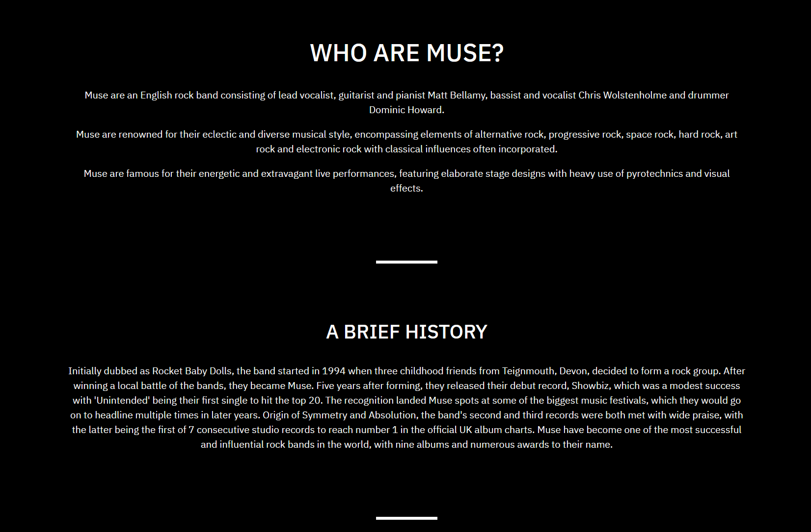

The home page features a striking hero image which contrasts beautifully with the dark theme of the website. The hero image captures many great things about Muse, the lighting, stage design, props and a venue packed full of people.

The home page also features two text sections, the first giving a brief description of who the band are and the second giving a brief history of the band, mentioning some of their accomplishments. 

The home page targets the third and fourth user stories as the information is readily available and relevant to the website.


### Discography Page

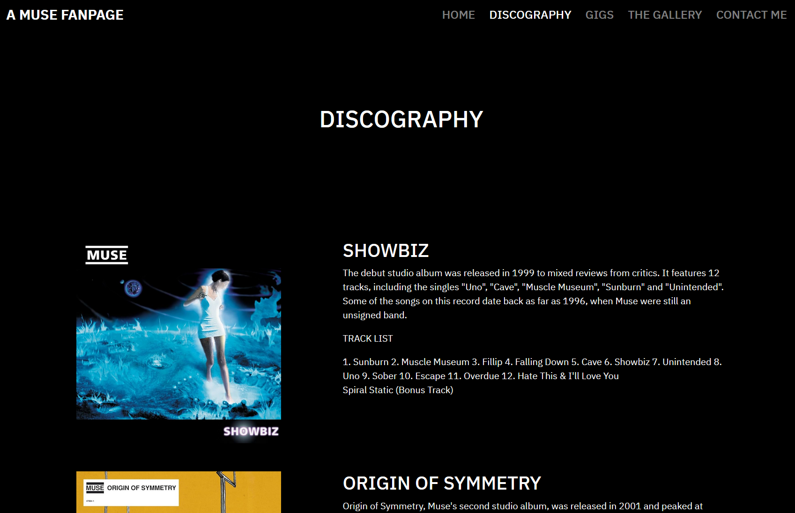
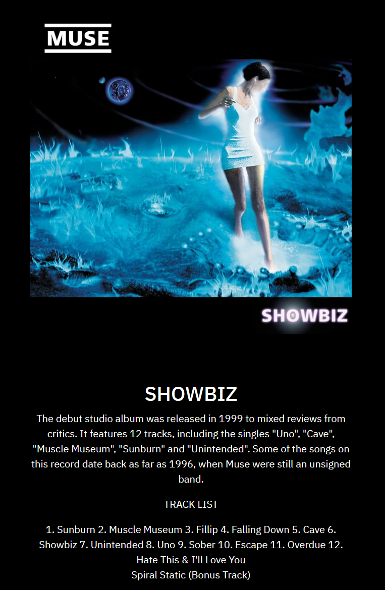

The discography page features the band's discography including an album cover, album title, description and track list for each studio album the band has released in chronological order.

On desktop, the content is split into two columns, with the album art on the left and the accompanying text on the right.

On mobile and tablet devices, the content is in one column, with the album art appearing before or above the accompanying text.

This page satisfies the second user story as it is responsive on a number of different devices, changing the layout to make better use of the screen real estate available.

This page also satisfies the fifth user story as it shows off the band's work and accomplishments.

### Gigs Page

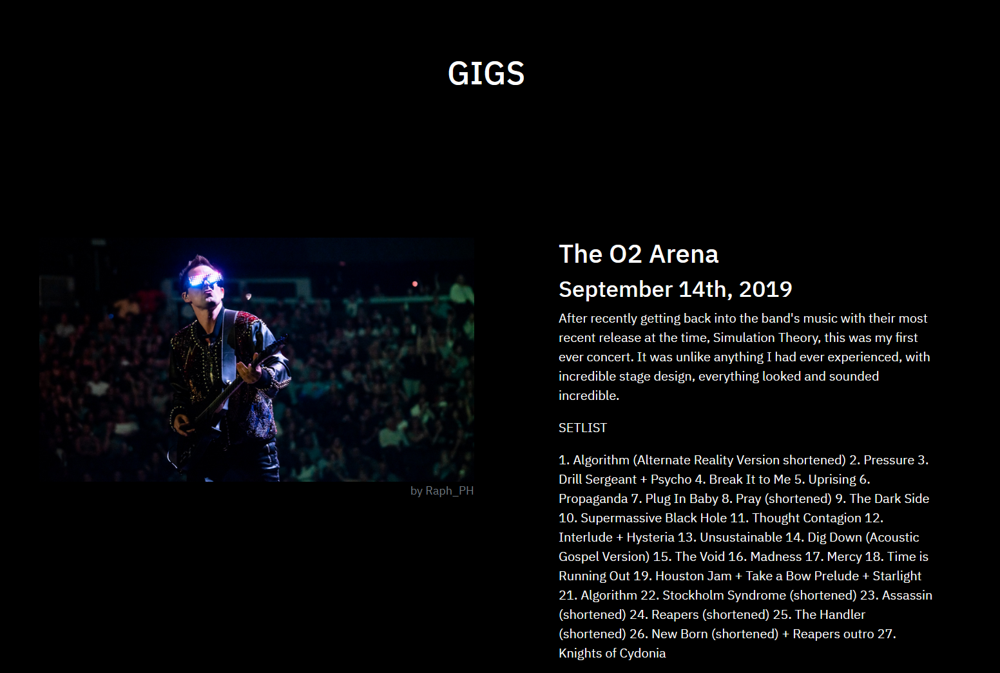
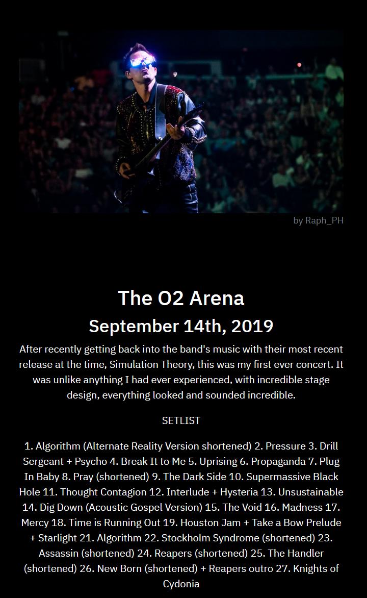

The gigs page features all the Muse concerts that I have been to so far.

The page features an image from the event, the venue, the date of the concert, a brief description and the setlist for each concert.

Like the discography page, the content is split into two columns on desktop, with the image on the left and the accompanying text on the right.

Also, the content is in one column on mobile and tablet devices, with the image appearing before or above the accompanying text.

This page satisfies the second user story as it is responsive on a number of different devices, changing the layout to make better use of the screen real estate available.

This page also satisfies the seventh user story as it gives some insight about why I like the band.

### Gallery Page

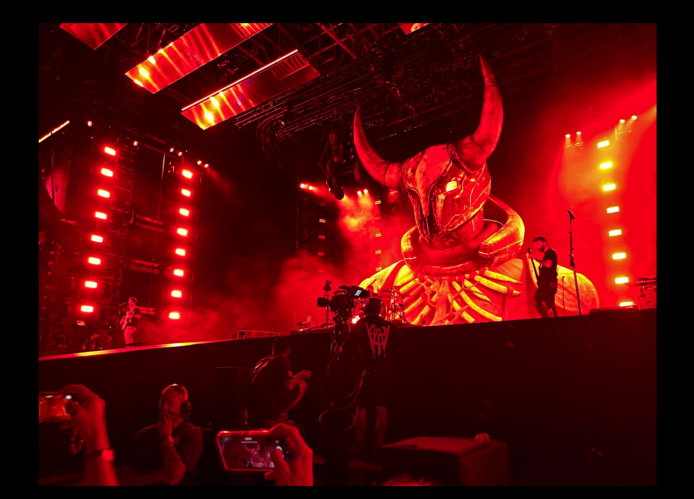
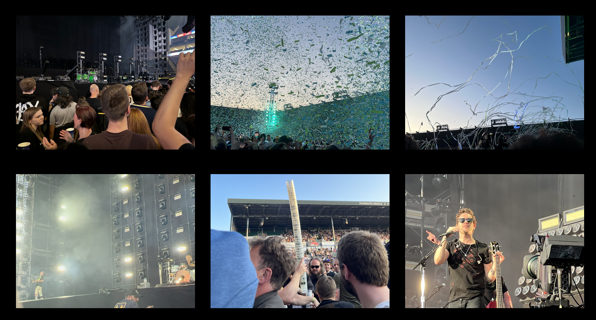
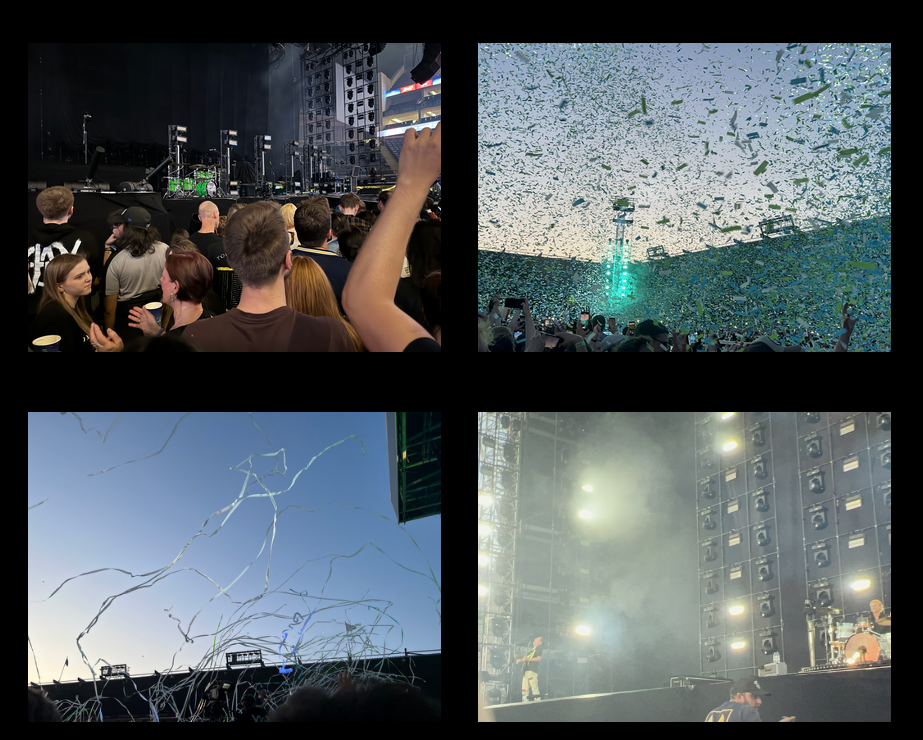
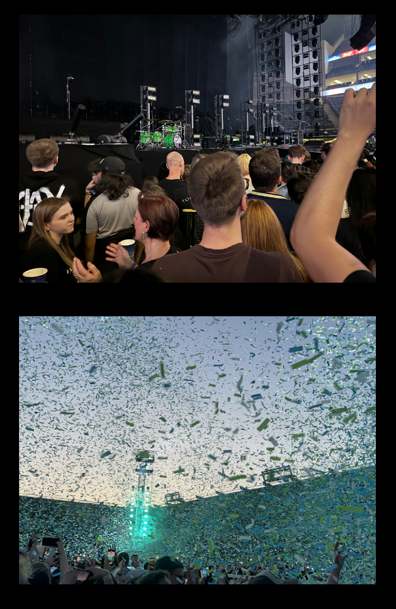

The gallery page features photos that I have taken at the Muse concerts I have been to.

The page features a main top image which is followed by the rest of the images.

On desktop, the images are split into 3 columns. On tablet, the images are split into 2 columns. On mobile, the images are all in one column.

This page satisfies the second user story as it is responsive on a number of different devices, changing the layout to make better use of the screen real estate available.

This page also satisfies the seventh user story as it gives some insight about why I like the band.

### Contact Page

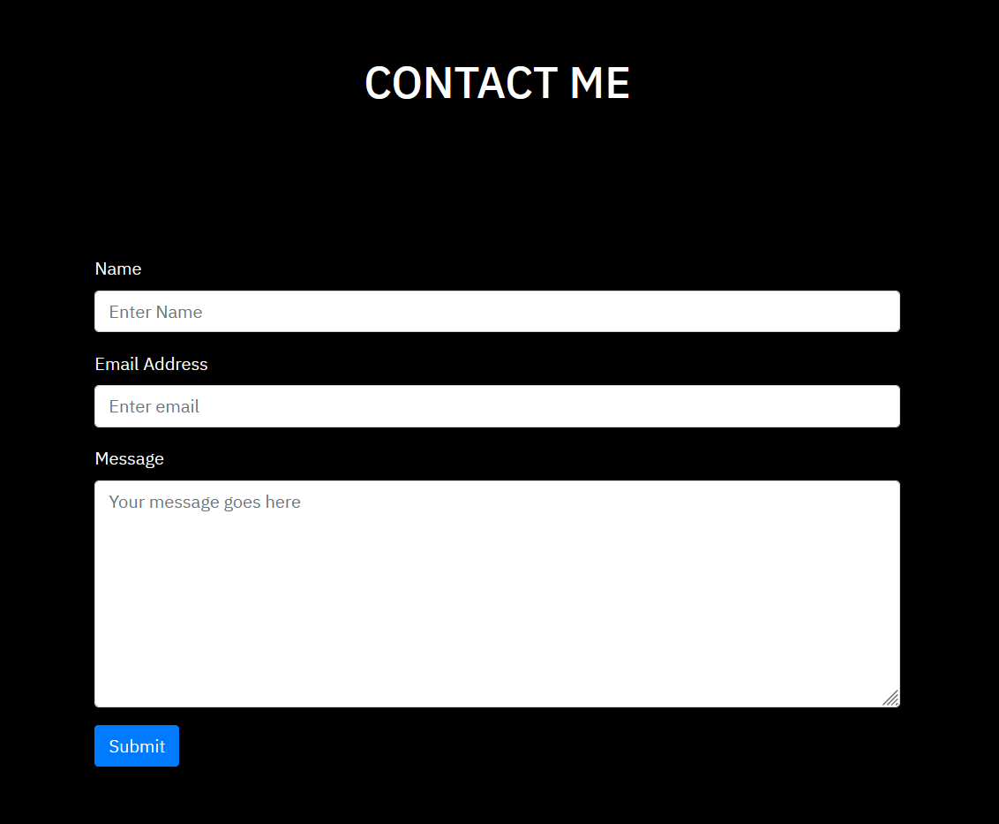

The contact page features a form for any visiting users to get in touch.

This page satisfies the final user story.

All opportunites derived from user stories have been achieved as detailed above.

### Features to Implement

Although I am mostly happy with my project, I believe that it can be improved in a few ways by implementing some additional features.

- Spotify Integration

  - The website could be made more engaging by encorporating some features linked to Spotify. Examples of this could be using embedded playlists for the albums on the Discography page or the album art shown on this page could link to the album on Spotify.
  - Another feature could be having the setlist of each concert on the gigs page as a Spotify playlist instead of just listing out the songs.
  - These features would allow for a more interactive experience, whilst also making it easier for new fans to listen to the band to see if they like the music.

- Last.fm Integration

  - Last.fm is a handy website where you can link streaming services such as Spotify and it tracks all of the songs that you listen to.
  - A new page on the website could be implemented, highlighting my favourite songs from the band, with screenshots or links showing my most listened to Muse songs since getting back into the band.

## Technologies Used

### Languages Used

- [HTML5](https://en.wikipedia.org/wiki/HTML5)
- [CSS3](https://en.wikipedia.org/wiki/CSS)
- [Javascript (via Bootstrap)](https://en.wikipedia.org/wiki/JavaScript)

### Frameworks, Libraries, Programmes and Tools Used

- [Codeanywhere](https://app.codeanywhere.com/): used to create the site (IDE).
- [Bootstrap 4.1.3:](https://getbootstrap.com/docs/4.1/getting-started/download/) was used to aid with responsive design and styling of the website.
- [Google Fonts:](https://fonts.google.com/) used to import the 'IBM Plex Sans' font into the style.css file which is used across the entire website.
- [Google Developer Tools:](https://developer.chrome.com/docs/devtools/) used for troubleshooting and testing.
- [Font Awesome:](https://fontawesome.com/) used to add icons for the social media links in the footer, used across all pages on the website.
- [jQuery:](https://jquery.com/) used to enable Bootstrap JavaScript.
- [Popper:](https://popper.js.org/docs/v2/) used to enable Bootstrap JavaScript.
- [Git:](https://git-scm.com/) used for version control by utilising the Codeanywhere terminal to commit to Git and push to GitHub.
- [GitHub:](https://github.com/) used to save and store the files for the project.
- [Microsoft Paint 3D:](https://en.wikipedia.org/wiki/Paint_3D) used for resizing images for the website.
- [Balsamiq:](https://balsamiq.com/) used to create the wireframes during the design process.
- [Am I Responsive?:](https://ui.dev/amiresponsive) used to create an image depicting what the website looks like on different devices.

## Testing

The W3C Markup Validation Service and W3C CSS Validator Service were used to validate every page of the project to ensure there were no syntax errors in the project.

When I initially checked my project, the validation service highlighted a few warnings.

- Ending link and hr tags with '/>'.
- Sections with no headings.

I changed this for each page and now every page passes the validation checks as seen here:

- [Index Page HTML](./docs/readme/index_html_validation.png) - Passed
- [Discography Page HTML](./docs/readme/discography_html_validation.png) - Passed
- [Gigs Page HTML](./docs/readme/gigs_html_validation.png) - Passed
- [The Gallery Page HTML](./docs/readme/gallery_html_validation.png) - Passed
- [Contact Me Page HTML](./docs/readme/contact_html_validation.png) - Passed
- [style.css CSS](./docs/readme/css_validation.png) - Passed

### Lighthouse Testing

For this project, I tested the performance, accessibility, best practices and SEO of the website using Lighhouse, one of the Chrome Developer Tools.

When initially testing using Lighthouse, the home page had an SEO score of 89, which led to a description and keywords being added to the head of each html file.

The initial score for accessibility on the home page was 91, which led to adding aria labels to the social media links in the footer, to improve accessibility.

#### Desktop Testing

##### index.html Desktop Page

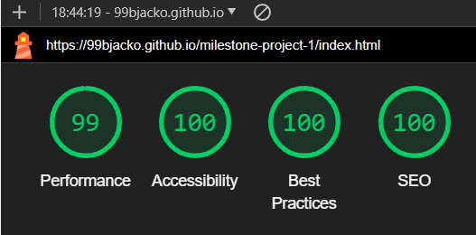

##### discography.html Desktop Page

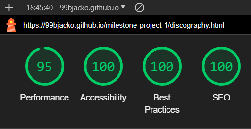

##### gigs.html Desktop Page

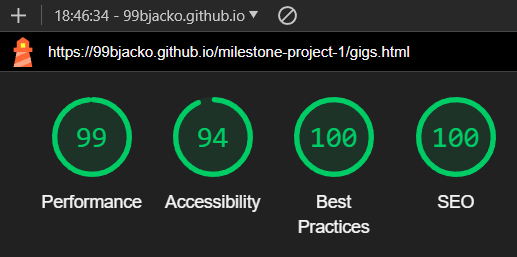

##### gallery.html Desktop Page

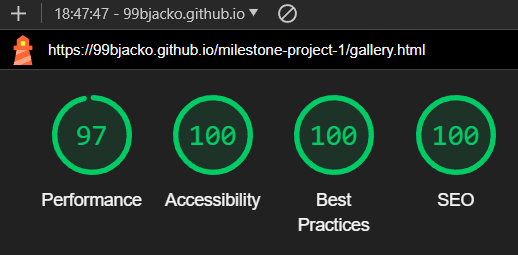

##### contact.html Desktop Page

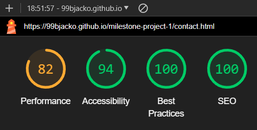

In general I am happy with the scores for the desktop version of this website. There are some improvements to be made, most notably the performance of the contact page, which is caused by some CLS issues.

The only dips in the other scores were in accessibility, where some pictures seem a little too dark against the black background, meaning not enough contrast is created.

These are things that can easily be looked at when looking to further improve the website.

#### Mobile Testing

##### index.html Mobile Page

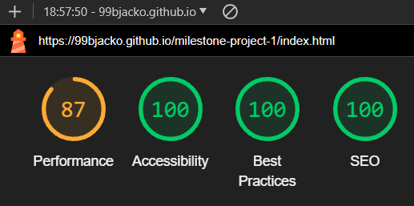

##### discography.html Mobile Page

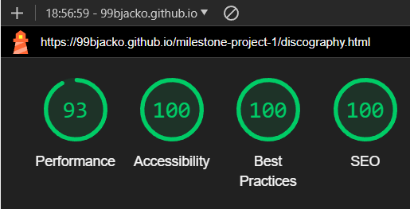

##### gigs.html Mobile Page

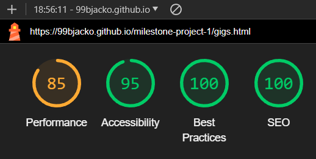

##### gallery.html Mobile Page

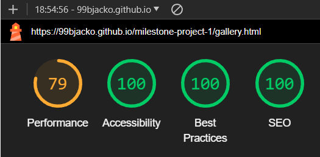

##### contact.html Mobile Page

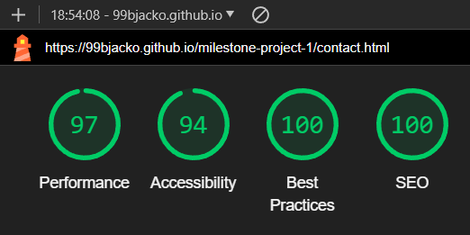

When testing for mobile, performance issues are more apparent in comparison with the desktop version of the site. The pages with larger images seemed to be the most affected in this case, so looking at future optimisation would help the score a lot.

The performance issues experienced with the contact page on desktop seems to not affect the mobile version of the site, showing the best score out of any page on mobile. 

Performance aside, the only other imperfections were the legibility of some darker images against the black background of the website, so overall I am decently happy with how the testing went, but there is definite room for improvement in future versions.

## Deployment

The site was deployed to GitHub pages. The steps to deploy are as follows:

1. Log in to GitHub
2. In the GitHub repository for this project, milestone-project-1.
3. Navigate to the *Settings* tab
4. Select the pages link from the menu on the left hand side
5. Under the Build and deployment heading, make sure the source selected is *Deploy from a branch*.
6. In the branch section, select the *Main* branch from the drop-down menu and click Save.
7. A message will be displayed to indicate a successful deployment to GitHub pages and a live link will appear.

You can find the live site at this link: <https://99bjacko.github.io/milestone-project-1/>

### Forking the GitHub Repository

Forking the GitHub repository allows a copy of the original repository to be made without affecting the original repository. This can be achieved by following these steps:

1. Log in to GitHub.
2. Navigate to the repository for this project, milestone-project-1.
3. Click the Fork button in the top right corner.

### Making a Local Clone

1. Log in to GitHub.
2. Navigate to the GitHub repository for this project, milestone-project-1.
3. To clone the repository using HTTPS, copy the link under "Clone with HTTPS".
4. Open a GitBash terminal and navigate to the location you want to use for the cloned directory.
5. Use the git clone command with the URL copied in Step 3.

```
$ git clone https://github.com/99bjacko/milestone-project-1.git
```

7. Press Enter. Your local clone will be created.

## Credits

### Code

- [Bootstrap 4.1.3](https://getbootstrap.com/docs/4.1/getting-started/download/) was used throughout the project, utilising the built in Grid System to ensure that the site is responsive across multiple devices.
- Code from [W3Schools](https://www.w3schools.com/html/html_favicon.asp) was used to add a favicon to the website.

### Content

- All text content was written by the developer.
- [Official Charts](https://www.officialcharts.com/artist/4712/muse/) was used for information about how singles and albums performed, featured in the discography page.
- [Wikipedia](https://en.wikipedia.org/wiki/Muse_(band)) was used for information about the band and their work, featured in the discography page.

### Media

- Hero image from [Ayrton Digital Lighting](https://www.ayrton.eu/live/ayrton-perseo-and-domino-lt-fixtures-shine-on-muses-will-of-the-people-north-american-tour/) by Steve Jennings.
- All album covers are property of [Muse](https://www.muse.mu/).
- Favicon image from [MuseWiki](https://musewiki.org/MuseWiki).
- O2 Arena image from [Flickr](https://www.flickr.com/photos/raph_ph/48735640158/in/album-72157710848159803/) by Raph_PH.
- O2 Arena image from [MuseWiki](https://musewiki.org/File:Muse_O21_6.jpg#file).
- All other images were created by the developer.

### Acknowledgements

- Code Institute for all course material
- Code Institute Slack community for assistance and guidance on the project
- My mentor, Rahul, for providing feedback and encouragement throughout the process.
